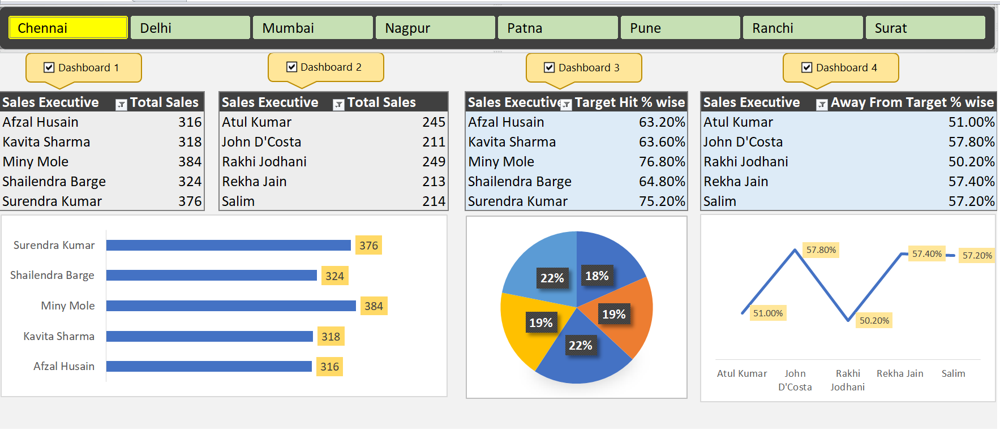

# 📊 Interactive Sales Performance & Analytics Excel Dashboard



## 📌 Project Overview
This repository contains an **Interactive Sales Performance Analytics Dashboard** created using **Microsoft Excel**. The dashboard takes raw 5-day sales tracking data across 8 major regions and transforms it into real-time key performance indicators (KPIs), variance analytics, and visual charts to monitor individual sales executives and overall operational efficiency.

---

## 🔑 Key Dashboard Features

- **Interactive Slicers (Multi-Region Filter):** Instantly switch view between regions — *Chennai, Delhi, Mumbai, Nagpur, Patna, Pune, Ranchi, and Surat*.
- **Executive Sales Performance:** Dynamic ranking of total sales completed by individual team members.
- **Target Hit % Tracking:** Automatic calculation of individual quota completion against standard benchmark targets (500 units).
- **Away From Target % Variance Analysis:** Highlights performance gaps to help sales leads identify coaching needs.
- **Multi-Chart Analytics Suite:**
  - **Horizontal Bar Chart:** Direct comparison of total volume sold by representative.
  - **3D Doughnut/Pie Chart:** Visualizing proportion of target hit metrics.
  - **Line Chart with Data Labels:** Trend line illustrating the exact percentage variance away from targets.

---

## 📊 Dataset Schema

The raw data (`Sales_Performance_Data.xlsx`) is structured as follows:

| Column Name | Data Type | Description |
| :--- | :--- | :--- |
| `Emp Code` | Text | Unique employee code (e.g., `Mum-TCL001`) |
| `Sales Executive` | Text | Full name of the sales representative |
| `Region` | Text | Assigned geographic region/city |
| `Day1` – `Day5` | Numeric | Daily unit sales counts recorded over 5 days |
| `Total Sales` | Numeric | Total 5-day cumulative sales (`=SUM(Day1:Day5)`) |
| `Target` | Numeric | Standard assigned sales target quota (500 units) |
| `Target Hit %` | Percentage | Sales quota achievement ratio (`=Total Sales / Target`) |
| `Away From Target %` | Percentage | Gap remaining to achieve target (`=1 - Target Hit %`) |

---

## 📈 Key Insights & Analytical Findings (e.g., Chennai Region)

- **Top Performers:**
  - **Miny Mole:** Top volume generator with **384 units** sold (**76.80% Target Hit Rate**).
  - **Surendra Kumar:** Second highest performer with **376 units** sold (**75.20% Target Hit Rate**).
- **Variance Tracking:** Executives with an "Away From Target" gap higher than **50%** (e.g., *John D'Costa* at **57.80%**) are flagged for follow-up support.

---

## 📁 Repository Structure

```text
├── Dashboard.png                 # High-resolution screenshot of the Excel Dashboard
├── Sales_Performance_Data.xlsx   # Main Excel File (Raw Data + Pivots + Interactive Dashboard)
└── README.md                     # Project documentation & guidelines
